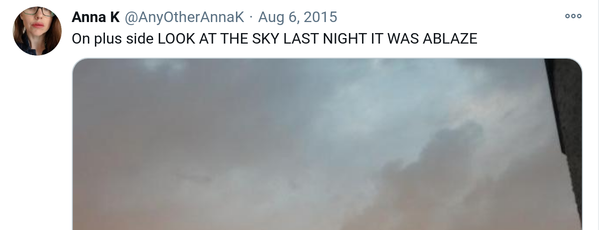

<h1 align="center">
<p><a href="https://www.kaggle.com/c/nlp-getting-started">Real or Not? NLP with Disaster Tweets</a></p>
</h1>

## Kaggle Competition Description:
This section is taken verbatim from the [kaggle competition page](https://www.kaggle.com/c/nlp-getting-started)

>Twitter has become an important communication channel in times of emergency.
>The ubiquitousness of smartphones enables people to announce an emergency they’re observing in real-time. Because of this, more agencies are interested in programatically monitoring Twitter (i.e. disaster relief organizations and news agencies).
>
>But, it’s not always clear whether a person’s words are actually announcing a disaster. Take this example:




>The author explicitly uses the word “ABLAZE” but means it metaphorically. This is clear to a human right away, especially with the visual aid. But it’s less clear to a machine.
>In this competition, you’re challenged to build a machine learning model that predicts which Tweets are about real disasters and which one’s aren’t. You’ll have access to a dataset of 10,000 tweets that were hand classified. If this is your first time working on an NLP problem, we've created a [quick tutorial](https://www.kaggle.com/philculliton/nlp-getting-started-tutorial") to get you up and running.
>Disclaimer: The dataset for this competition contains text that may be considered profane, vulgar, or offensive.</p></div>

> ### Acknowledgments
>This dataset was created by the company figure-eight and originally shared on their ‘Data For Everyone’ website here.

>Tweet source: https://twitter.com/AnyOtherAnnaK/status/629195955506708480
## Project Organization
<details>
<summary><b>Hierarchy</b>
</summary>
<p>

```

    ├── LICENSE
    ├── dockerfiles        <- Folder that contains all project images, both GPU and vanilla
    ├── docker-compose.yml <- docker-compose file that runs the vanilla image (deprecated by the makefile, but kept for compatibility issues) 
    ├── Makefile           <- Makefile with commands to build and run the various docker images
    ├── README.md          <- You're looking at me
    ├── data
    │   ├── external       <- Third-party data
    │   ├── features       <- Generated features and representations
    |   └── processed      <- Corrected dataset and other generated artifacts
    │   
    │
    ├── docs               <- A default Sphinx project; see sphinx-doc.org for details
    │
    ├── models             <- Trained and serialized models and model predictions in CSV format
    │
    ├── notebooks          <- Jupyter notebooks
    │                         
    │                         
    │
    ├── references         <- Data dictionaries, manuals, and all other explanatory materials
    │
    ├── reports            <- Generated analysis as HTML, PDF, LaTeX, etc.
    │   └── figures        <- Generated graphics and figures to be used in reporting
    │
    |
    │                         
    │
    |
    └── src                <- Source code and util functions used in the notebooks
        ├── __init__.py    <- Makes src a Python module
        │
        └── evaluation.py  <- Evaluates an sklearn(-compatible) model on the Kaggle training set and generates a submission file

```
</p>
</details>

<details>
<summary><b>Milestones</b>
</summary>
<p>

1. MS: Agree on core technologies & frameworks
    * **Description:**
        - Programming: Python3, scikit-learn, sphinx
        - Infrastructure: github, docker, notebooks
        - orga: discord, BBB
    * **Tasks:**
        - [x] Supervisor Kick-Off: everyone
        - [x] Discord server setup: everyone
        - [x] Repo setup: Chris
        - [x] Project plan: Julian + Karl
    * **Deliverables:** Project Plan, repository
    * **Due:** 23.11.2020

2. MS: Implement evaluation pipeline:
    * **Description:**
        - Shared evaluation pipeline: (1) read data -> (2) feed to model -> (3) generate score, plots + submission file
        - Idea: Once pipeline stands, everyone plays with models in step (2)
    * **Tasks:**
        - [ ] Implement data assembly: ? (pending)
        - [ ] Implement K-Fold Cross-Validation (k=?) as test splits: ? (pending)
        - [ ] Generate result graphs and scores: ? (pending)
        - [ ] Generate submission file: ? (pending)
    * **Deliverables:** Shared Evaluation Pipeline
    * **Due:** ?
3. MS: First Model Iteration:
    * **Description:**
        - Baseline model: Integrate simple model from tutorial (https://www.kaggle.com/philculliton/nlp-getting-started-tutorial)
        - Everyone plays with models in step (2)
    * **Tasks:**
        - [ ] Implement model from tutorial: ? (pending)
        - [ ] Implement own features & models: everyone (pending; fill in approach from each one)
    * **Deliverables:** Model dumps and their evaluation results
    * **Due:** ?
4. MS: Second Model Iteration:
    * **Description:**
        - Sync: Share insights & features from first iteration in group and with supervisor
        - Everyone attempts to improve their models from insights & features
    * **Tasks:**
        - [x] Sync Meeting (with supervisor?): everyone (pending)
        - [ ] Improve own features & models: everyone (pending)
    * **Deliverables:** Model dumps and their evaluation results
    * **Due:** ?
5. MS: Final Presentation
    * **Tasks:**
        - [ ] Intro slides: ? (pending)
        - [ ] Leaderboard stats slide: ? (pending)
        - [ ] Our result slides: everyone (pending)
    * **Deliverables:** Presentation Slides
    * **Due:** ? (end of january)
6. MS: Final Report
    * **Tasks:**
        - [ ] Abstract: ? (pending)
        - [ ] Intro: ? (pending)
        - [ ] Related Work: ? (pending)
        - [ ] Methods: ? (pending)
        - [ ] Result: ? (pending)
        - [ ] Discussion: ? (pending)
    * **Deliverables:** Report Document
    * **Due:** ? (end of february)
</p>
</details>

## Docker
To fire up the environment using docker-compose, run:
```console
foo@bar:/disaster-tweets$ docker-compose up
```
To fire up the environment using docker, run:
```console
foo@bar:/disaster-tweets$ docker run --rm -p 8888:8888 --mount type=bind,source=$PWD,target=/home/jovyan cakiki/disaster-tweets
```


<p><small>Project based on the <a target="_blank" href="https://drivendata.github.io/cookiecutter-data-science/">cookiecutter data science project template</a>. #cookiecutterdatascience</small></p>
